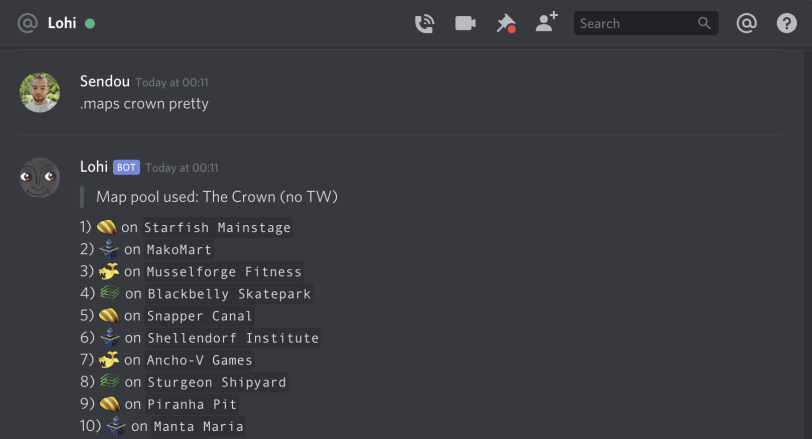

## Lohi 🐟

Lohi is a general purpose Discord bot mostly with features related to Splatoon. It will provide an alternative way to access content on [sendou.ink](https://github.com/Sendouc/sendou-ink). When it's more feature complete it is planned people will be able to invite it to their own servers.

If you join the Discord using the button above you can try out Lohi on the #bot channel or by sending a direct message to it. Get started by typing `.help`

## Screenshot

## Some features

🤖 Command to update bot by using `git pull` to get the latest version.

🤖 Make it automatic for people to request roles with the color of their request as well as edit these roles.

🤖 Parses and posts voting related data from Google Sheets.

🤖 Fetch builds from the sendou.ink API and display them in a Discord friendly format.

🤖 Generate map pools using a map list fetched from the sendou.ink API.

🤖 Browse the upcoming solo rotations with optional filter parameters.
